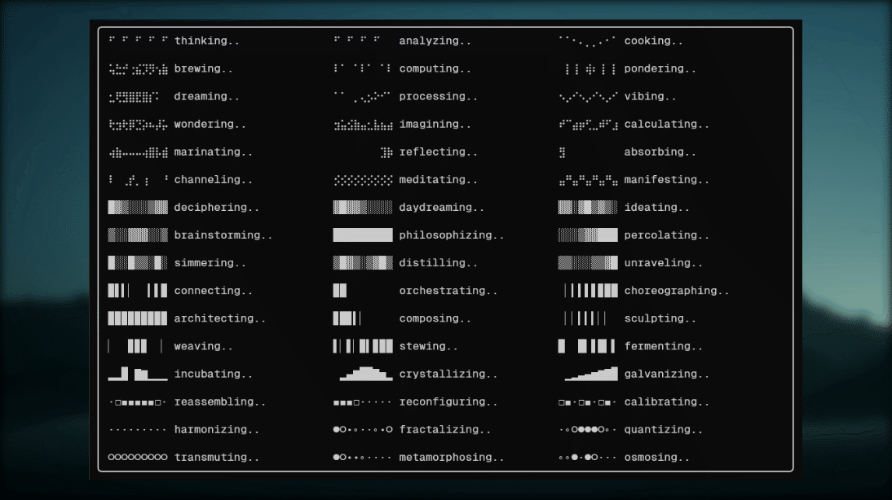

# agents-are-thinking

A Weekend project exporing agents' "thinking" animation.

Terminal animation effects built with braille, block characters, and unicode glyphs. Pure Python, no dependencies.



## Get Started 

``` bash
uv add agents-are-thinking
```

### I just want to watch agents thinking in terminals

``` bash
uv tool install agents-are-thinking[cli]  # with rich and click
uv tool run agents-are-thinking preview
```

And Enjoy :)

## Usage

```python
import time
from agents_are_thinking import ShadeFire

ef = ShadeFire()
t0 = time.time()
for frame in ef:
    print(f"\r{frame}", end="", flush=True)
    if time.time() - t0 > 5:
        break
```

### With Rich

```python
import time
from rich.live import Live
from agents_are_thinking import BrailleFire

ef = BrailleFire()
t0 = time.time()

with Live(refresh_per_second=16) as live:
    for frame in ef:
        time.sleep(0.1)
        live.update(frame)
        if time.time() - t0 > 5:
            break
```

### Effect list

```python
from agents_are_thinking import EFFECTS

for cls in EFFECTS:
    print(cls.name, "-", cls.description)
```

## CLI

`agents-are-thinking` ships with a CLI for previewing effects in your terminal. Requires the `[cli]` extra.

```
uv tool run agents-are-thinking preview          # gallery showcase
uv tool run agents-are-thinking list             # list all effects
uv tool run agents-are-thinking run braille-spin # run a single effect
uv tool run agents-are-thinking                  # name-effect showcase
```

## All effects

### Braille

| Effect | Description |
|--------|-------------|
| `BrailleSpin` | Braille spinner, same char repeated |
| `BrailleSpin2` | Braille spinner, wider path |
| `BrailleWave` | Smooth sine wave scrolls across as braille dots |
| `BrailleRandom` | Each column picks random dots |
| `BrailleBreathe` | Gentle breathing pattern |
| `BrailleRipple` | Ripple radiating from center |
| `BrailleBounce` | Dots bouncing across |
| `BrailleRain` | Falling dots |
| `BrailleZigzag` | Zigzag path |
| `BrailleDissolve` | Dissolve and reform |
| `BrailleFire` | Fire simulation |
| `BrailleNoise` | Static noise |
| `BrailleHeartbeat` | Heartbeat pulse |
| `BrailleArrow` | Arrow pattern |
| `BrailleScanner` | Scanner sweep |
| `BrailleMatrix` | Matrix-style rain |
| `BrailleCheckerboard` | Checkerboard toggle |
| `BrailleCheckerboard2x2` | 2x2 checkerboard toggle |

### Shade

| Effect | Description |
|--------|-------------|
| `ShadeWave` | Smooth sine wave as shade blocks |
| `ShadeScanner` | Scanner sweep as shades |
| `ShadeFire` | Fire simulation with shade characters |
| `ShadeRipple` | Ripple radiating from center |
| `ShadeBreathe` | Gentle breathing pattern |
| `ShadeSeeSaw` | Left and right halves alternate |
| `ShadeBlink` | Blinking pattern |
| `ShadeLayers` | Layered shading |
| `ShadePinch` | Pinch effect |

### Bar

| Effect | Description |
|--------|-------------|
| `BarBounce` | Each bar bounces independently |
| `BarWave` | Smooth sine wave scrolls across as bar heights |
| `BarSeeSaw` | Left and right halves alternate like a seesaw |

### VBlock

| Effect | Description |
|--------|-------------|
| `VBlockWave` | Smooth sine wave |
| `VBlockFill` | Fill and drain |
| `VBlockTide` | Tide coming in and out |
| `VBlockBreathe` | Gentle breathing pattern |
| `VBlockBounce` | Bounce across |
| `VBlockPulse` | Pulse effect |
| `VBlockRipple` | Ripple from center |
| `VBlockRain` | Falling blocks |
| `VBlockCascade` | Cascade effect |

### Square

| Effect | Description |
|--------|-------------|
| `SquarePulse` | Pulse effect |
| `SquareFill` | Fill and drain |
| `SquareBlink` | Blinking pattern |
| `SquareArrow` | Arrow pattern |

### Dot

| Effect | Description |
|--------|-------------|
| `DotWave` | Smooth sine wave |
| `DotPulse` | Pulse effect |
| `DotHeartbeat` | Heartbeat pulse |
| `DotArrow` | Arrow pattern |
| `DotBounce` | Bounce across |
